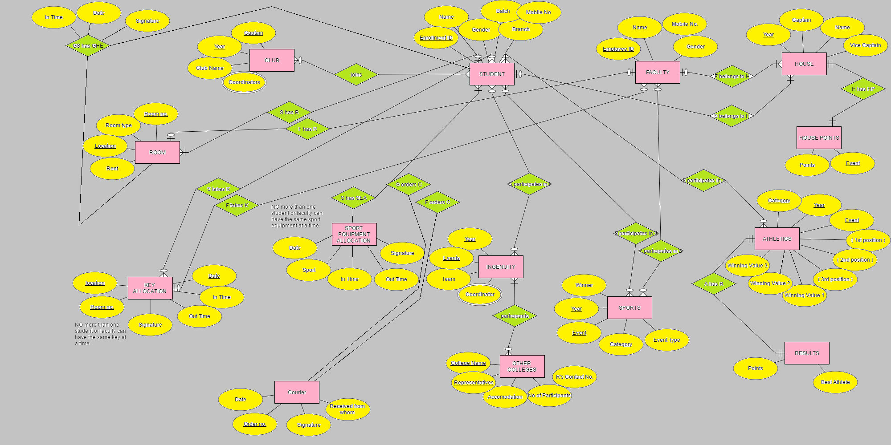
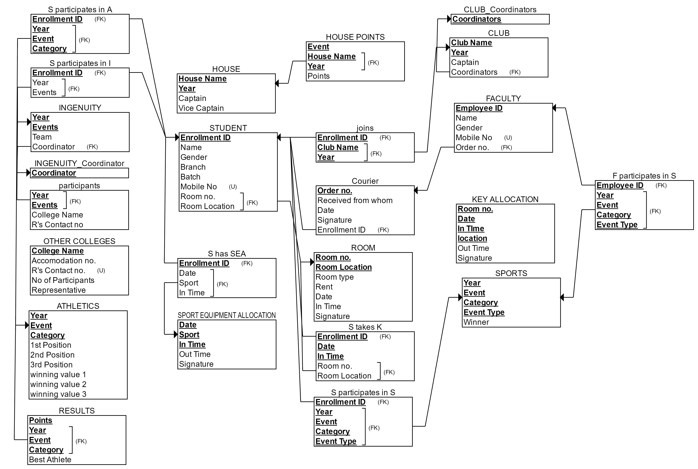

# College-Events-Database
Database for the various events held in the university. The rationale behind the normalization of the database can be found in ```database_normalization.docx``` and the database description including its various attributes can be found in ```description.docx```.



<p align="center"><b>ER diagram</b></p>


<br><br/>


<p align="center"><b>Database schema</b></p>